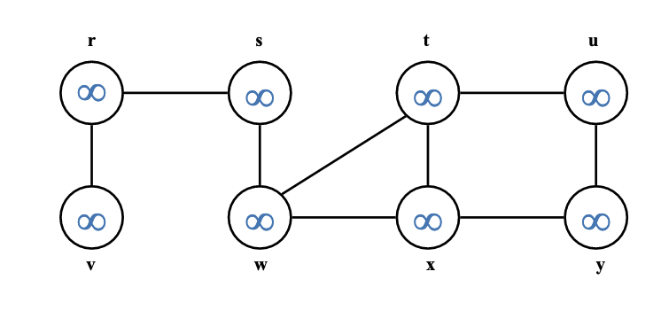
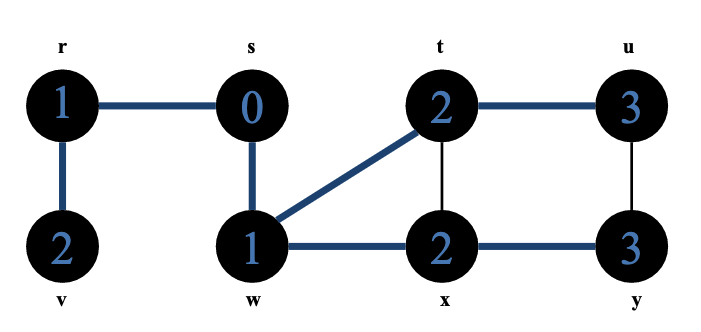
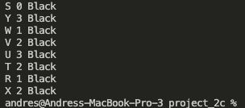
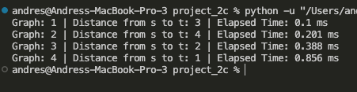

To run main/batch file with all 4 graph cases, do "python main.py". A screenshot of output is at the very bottom of this page.

If there is no path from s to t, the output is "There is no path from s to t." Rerun the program multiple times to see

-------------------------------------------
The general look of the graph is as follows


```
# r = Node("r", None, float("inf"), "White")
# v = Node("v", None, float("inf"), "White")
# s = Node("s", None, float("inf"), "White")
# w = Node("w", None, float("inf"), "White")
# t = Node("t", None, float("inf"), "White")
# x = Node("x", None, float("inf"), "White")
# u = Node("u", None, float("inf"), "White")
# y = Node("y", None, float("inf"), "White")

# adjList = {
#     v: {r},
#     r: {v, s},
#     s: {r, w},
#     w: {s, t, x},
#     t: {w, x, u},
#     x: {w, t, y},
#     u: {t, y},
#     y: {u, x}
# }
```





The function call: ```bfs(adjList=adjList, s=s, t=y)```



--------------------------

Expected runtime:

Create_graph_and_run_bfs algorithm:
(line8 is constant time)
(line 10-15 is V time)
(line 17-20 is E time)
(line 22-23 is constant time)

Bfs algorithm:
(line 6-11 constant time)
(line 12 to 20 E time)
(line 21 to 26 is constant time)

Note: I initialize each vertices color, parent, and distance in the create_graph_and_run_bfs algorithm. That is line (10 to 15)

Total time simplified of create_graph_and_run_bfs: O(V + E)

If we were to double the input each time, I expect a "linear graph" for time complexity.

-----------------------------

Results

When using the following data, we see an almost linear increase in time complexity. My prediction was correct. (note this is not the data that was asked of us). I just wanted to see what happened if we were to double the numbers each time.

```
create_graph_and_run_bfs(1, 25 nodes, 50 edges) -> 0.01129 ms
create_graph_and_run_bfs(2, 50 nodes, 200 edges) -> 0.022 ms
create_graph_and_run_bfs(3, 100 nodes, 400 edges) -> 0.37 ms
create_graph_and_run_bfs(4, 200 nodes, 800 edges) -> 0.717 ms
```
Results of the four random graphs we were asked to create are below

